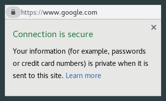

### Securing Your Website with HTTPS

#### Options for Setting Up Encrypted Connections

There are multiple options, and differing levels of involvement for you as a developer. While it is possible to set up HTTPS with your Spark server, you can also use CloudFlare.

#### HTTP vs HTTPS

HyperText Transfer Protocol(HTTP) is how information is sent between the user’s browser and the website they are visiting. 
HTTPS is simply, HyperText Transfer Protocol Secure, encrypts the information making a user’s visit to your website more secure.



#### CloudFlare

Cloudflare is a content delivery network that secures your website (or web-app) with HTTPS for free. When the user makes a request on your site, that information
has to make it to your servers, and back to the user. Cloudflare sits in the middle between the user and your servers, and ensures that the information between the user
and Cloudflare is encrypted. 

#### Buying a Domain Name:

Got a Domain Hosting Service(GoDaddy, NameCheap, HostGator, Google Domains). Notice university accounts can’t use Google Domains due to account restrictions. 
Search for your desired domain name and buy one. This domain might not be used beyond the current iteration, so don’t feel the need to spend a lot.

#### Setting Up CloudFlare:

Create a CloudFlare account. After entering your email and password, they will ask you for your website name. 
You can do this now, or save it for after you have brought a domain name. 
(If you choose to do this step later, you can add a site to your cloudflare account by clicking the blue “Add site button” on the homage page after logging in).  
After you add a site, it will ask you to select a plan. Choose the Free one, $0/month. Then they will show a DNS table 
(type, name, value, etc.) with three entries. You probably want to delete these. Then you should add an entry like this: 

*Type: A*  
*Name: yourdomain.com*  
*Value: your droplet IP address without a port*  
*TTL: Automatic*

ALSO: Add another record with these settings:

*Type: A*  
*Name: www*  
*Value: your droplet IP address without a port*  
*TTL: Automatic*  

Now CloudFlare will suggest that you change the pointers to your nameservers. 
Please take note of the values suggested, as you will need these in the near future.

Our’s looked like this:

graham.ns.cloudflare.com
zita.ns.cloudflare.com

If you use GoDaddy, Cloudflare should walk you through the process of replacing the nameservers on your domain host with Cloudflare nameservers. 
If you use another domainhost (like NameCheap, HostGator, etc), go to their website, log in, and look under Custom DNS, usually under Domain or DNS tabs. 
Proceed to replace the default values with the cloudflare one above.

Add your website, https://yourdomain.com, to Google Developer console under Authorized JavaScript origins and Authorized redirect URIs. 
Notice, it’s https not http.

Go to the Crypto tab on CloudFlare and scroll down to “always use HTTPS” and turn it on. 
Normally, just typing in your website will redirect to the http version of the website which Google Login Button is not a fan of, but turning this on redirects all traffic to your website to the https version.
This is important, so customers don’t accidently visit your http version of website and have trouble with the google sign in object.


#### Drawbacks of using CloudFlare


CloudFlare encrypts the connection between your client and cloudflare, but the information going between Cloudflare and your server is NOT ENCRYPTED. 
This might not be a big deal, since this connection is probably hard to find and exploit (our project used Cloudflare). However, this is still a weakness. 
No matter how remote or difficult to exploit the connection, this problem still means the information is not secure.


CloudFlare does have a Full SSL option (in contrast to the previously described implementation, which uses the Flexible SSL), but this requires you to configure your own web server for SSL instead of just making a DNS change. 
Other problems include slower loading times (User have to go through Cloudflare before they get to your site). 


Other problems include slower loading times (User have to go through Cloudflare before they get to your site). 

……………………..

####Spark Server and HTTPS

The current server we are using is Apache Spark 2.7.2… though Apache doesn’t keep documentation of previous versions of Spark. 
As of writing this, here are the current docs:


http://sparkjava.com/documentation#secure


And more….

http://sparkjava.com/documentation#how-do-i-enable-sslhttps

From the second link…
>“Enabling HTTPS/SSL requires you to have a keystore file, which you can generate using the Java keytool [(→ oracle docs)](https://docs.oracle.com/cd/E19509-01/820-3503/ggfen/index.html). 
> Once you have the keystore file, just point to its location and include its password.”

>“Check out the fully working example on GitHub if you need more guidance.”


And for those who are lazy, some pseudo-code from the server…

```java
Import static spark.SparkStuff;

Public class example {
  
	// View example at https://localhost:4567/secureHello
	
	Public static void main(String[] argz) {
		secure (“deploy/keystore.jks”, “password”, null ,null);
		get(“/secureHello”, (req, res) -> “Hello Secure World”); }
}
```

Please refer to Oracle's documentation if you wish to implement HTTPS on your own. Good luck.


