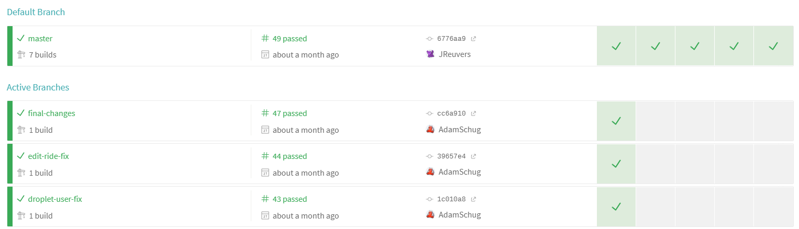

# Morride

Morride is a ridesharing platform designed for the Morris community. Lots of students who go to Morris do not have cars, but still need to get around, whether it's a long trip or during the brutal Minnesota winter, these students rely on others to get around. However, since we cut our previous ride sharing platform due to extremely high costs, our student Facebook page has been flooded with rideshare requests, which isn't the best place for them. We created this platform to take these requests off of Facebook and into a platform exclusive to ridesharing. 

This project was created as a part of CSCI 3601, which I took in Spring 2019. 

A view of the application. Here you can add a ride, filter and view the ride list, edit or delete your rides, or join other rides.

## Tools, Frameworks, and Methods

Languages and APIs
-	Java Spark
-	Mongo DB
-	Angular + Typescript
-	Google OAuth

Software Development Tools and Practices
-	Agile
-	Git + GitHub
-	ZenHub
-	Slack

Testing/Continuous Integration
-	Travis CI
-	Junit (Sever Unit Testing)
-	Jasmine + Karma (Client Unit Testing)
-	Protractor (End to End Testing)

## Development Process

Iteration 1
During the first iteration, we created a basic CRUD app, allowing for users to create, view, edit, and delete rides. I primarily worked on the server-side code, writing an API to interface with our Mongo database. Additionally, I was part of a group that helped provide guidelines for what our database should look like for this project. After getting the back end working and tested, I worked with other developers who had been working on the front end to connect with the API.
Due to this iteration being at the start of the course, proper use of GitHub and general development practices began low. I encouraged my group to use pull requests, preferably with a code review, as well as including testing with all code as you write it. However, we didn’t do the best job of this always, myself included. I’ve included two pull requests that show some of my contributions to the project.
https://github.com/UMM-CSci-3601-S19/iteration-1-javu/pull/22
https://github.com/UMM-CSci-3601-S19/iteration-1-javu/pull/28

Iteration 2
In the second iteration I primarily worked on the back end once again, as the implementation of user profiles changed our database structure. We ran into hurdles, both due to working with mongo and due to some versioning issues with mongo on our hardware. However, we were able to work through it and deliver the promised features. Our software design principles improved this iteration also, as we were doing more pull requests and communicating more efficiently. I’ve once again linked a pull request representative of my contribution.
https://github.com/UMM-CSci-3601-S19/iteration-2-sixteeneyes/pull/20

Iterations 3 and 4
	In iteration 3 we hit large hurdles with implementing login with Google. We were given documentation from previous software design groups and were able to implement their solution very quickly. However, we immediately noticed issues with nearly all parts of the solution, from storing data in plain text in local storage to API endpoints not being secure, allowing anyone to act as any user. We could have continued with this route, as classes have done in the past and other groups continued to do, but we decided it would be best to ensure our implementation of OAuth was correct. We spent the rest of that iteration and the next correctly researching, implementing, and documenting Google’s OAuth platform so that our project as well as future classes could learn from our experience and improve their authentication platform in a fraction of the time it took us. Rather than a pull request, I’ve linked to the documentation we wrote.
https://github.com/UMM-CSci-3601-S19/iteration-4-endgame/tree/master/Documentation

## Tools

### Agile
The agile approach to software development was used throughout the project. We divided our development time into 4 iterations, roughly 2 weeks each. Our team size varied from 4 to 6 people. Although the nature of being a class rather than work changed some aspects of agile development, we did our best to stick to the core beliefs of agile. 

We began our development with an inception deck, communicating with the customer early so we knew what they were looking for in a project. Then, at the start of each iteration we sold stories to the customer, coming together to decide what functionalities were both best for the project and practical to develop at this point in the project. Finally, at the end of the iteration, we showed the customer our progress, taking notes on any feedback they have for us. We also had a retrospective to reflect on what went well and poorly throughout the process as developers. This was important so that we weren't just improving the project we were selling to the customer, but improving ourselves as developers.

### Travis CI
We used Travis-CI for continuous integration. This was incredibly useful throughout the project, not only letting us know whether our code passed testing or not, but additionally holding group members accountable for testing their code well. Finally, because we implemented slack updates whenever a build ran, it kept group members up to date with the most recent changes and the general status of the project

### Slack
Slack was the primary tool we used for communication between team members. This was an incredibly useful thing to have, especially in an environment where we had to regularly schedule meeting times that fit some busy schedules. This was made even better by integrating plugins like Travis to notify us about builds. 

## DOCUMENTATION
1. [CLIENT_TESTING_WITH_OAUTH: How to structure client tests](https://github.com/UMM-CSci-3601-S19/iteration-4-endgame/blob/master/Documentation/CLIENT_TESTING_WITH_OAUTH.md)
2. [Deploying and Development: How to set up your development and deployment environments](https://github.com/UMM-CSci-3601-S19/iteration-4-endgame/blob/master/Documentation/Deploying%20and%20Development.md)
3. [Endpoint Lockdown Notes: How to lock down the API](https://github.com/UMM-CSci-3601-S19/iteration-4-endgame/blob/master/Documentation/Endpoint%20Lockdown%20Notes.md)
4. [HTTPS: How to secure your connection between client and Cloudflare as HTTPS, with notes on what may be done to secure Cloudflare to server](https://github.com/UMM-CSci-3601-S19/iteration-4-endgame/blob/master/Documentation/HTTPS.md)
5. [documentation_e2e: How to set up end to end testing](https://github.com/UMM-CSci-3601-S19/iteration-4-endgame/blob/master/Documentation/documentation_e2e.md)

## ToDo List & Known Issues: 
See our issues and ZenHub for known issues and ToDo list. In particular, the New Issues and Out of Scope pipelines. Each issue or epic 
has some sort of description about what we know or why we didn't get around to something in time.
